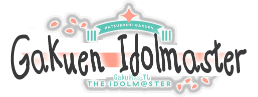

<h2 align="center">

      
<i>An English patch for Gakuen Idolmaster DMM version!</i> 
 
</h2>

# English Patch for Gakuen Idolmaster (DMM Translation Patch)

## Overview
This reposition is a fusion of two framework:
- **Localify**  
  ([GitHub Release v3.0.0Beta](https://github.com/chinosk6/gakuen-imas-localify/releases/tag/v3.0.0Beta))
- **prebuilt Bepinex from Priconne Re:TL project**:
  - XUnity Auto Translate
  - Application resizing
  - Forced full screen (Alt+Enter)

This patch builds upon Localify by adding crucial functionalities that were previously missing.

## Project Goals
The main objectives of this project are:
- **Texture Translation:**  
  Extend translation support to include textures, which Localify does not cover.
- **Improved Variable Translation:**  
  Integrate Xuat’s translation method that, while not as polished as Localify in overall quality, excels in using regular expressions to handle the game’s numerous variables more effectively.
- **Implemet Auto Translation:**  
  Utilize multiple machine translation engines you can chose including SugoiofflineTranslate.

## Installation
Download this repo and extract it, make sure the following are in the same folder as the game executable:
- `version.dll`
- `version.dll`
- `winhttp.dll`
- `doorstop_config.ini`
- `dotnet` folder
- `Bepinex` folder
- `gakumas-local` folder

## First Run Notice
The initial run of the patch may take several minutes. This is normal, as the system sets up and configures all translation functionalities.

## Contributing
Contributions, bug reports, and feature requests are welcome! If you have any suggestions or improvements, please open an issue or submit a pull request.
or dm CorneliaC at discord

  